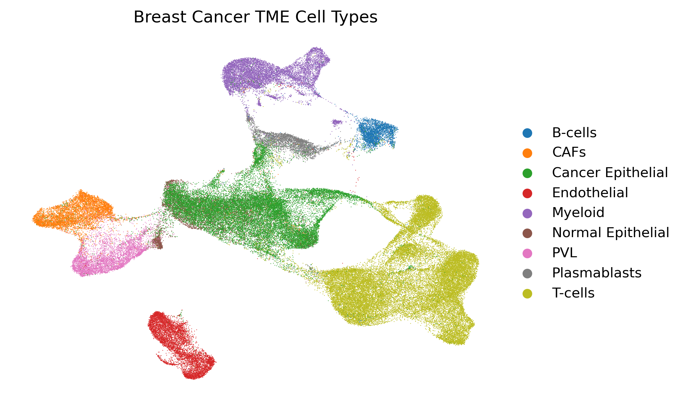
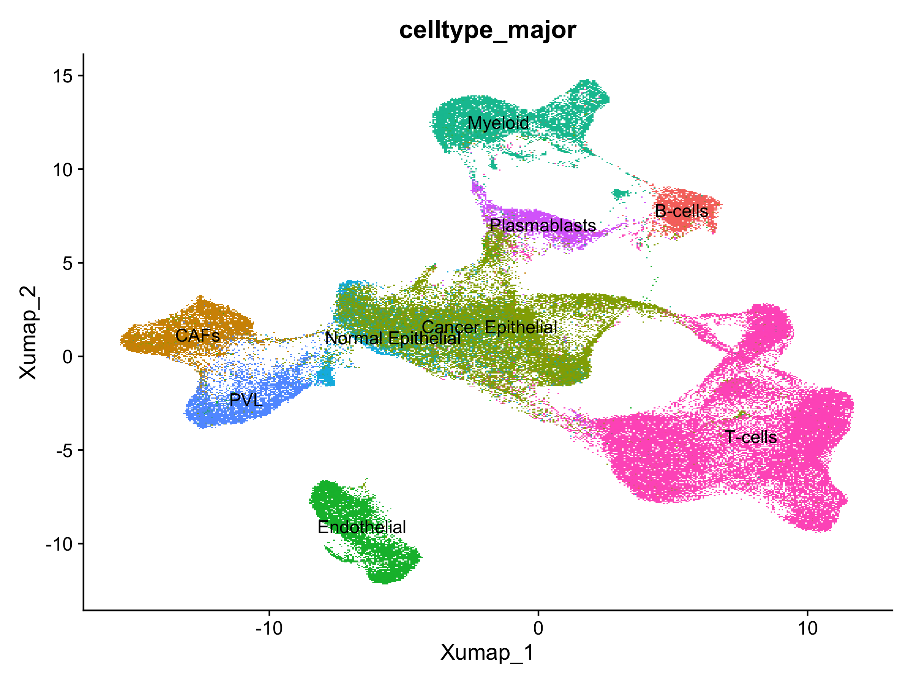
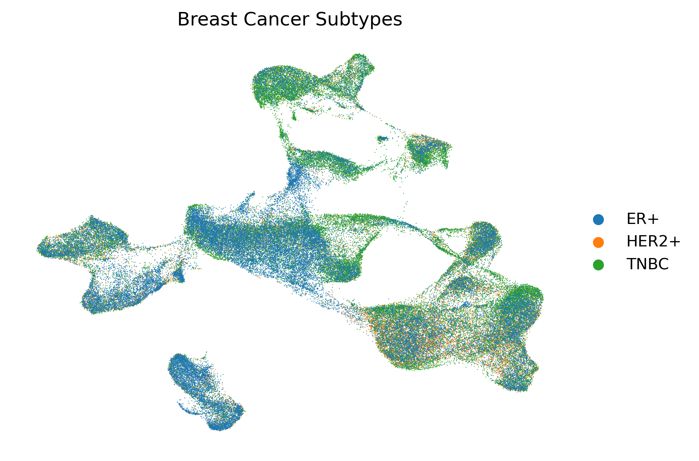
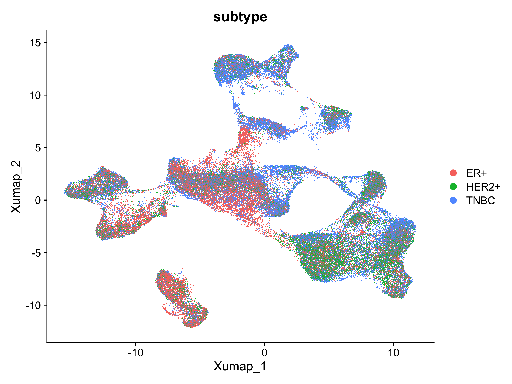
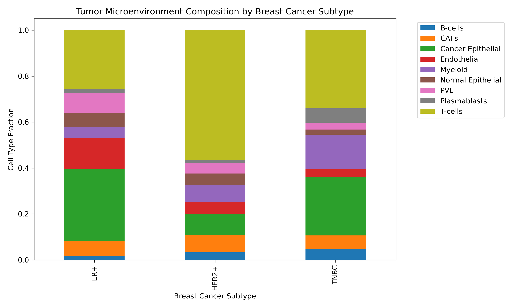

# 🧬 Single-Cell RNA-seq Analysis of Breast Cancer Tumor Microenvironment

## Project Goal

This project performs single-cell transcriptomic analysis of breast cancer tumor microenvironment (TME) using a public breast cancer scRNA-seq dataset. The goal is to identify tumor, immune, stromal, and endothelial cell populations and characterize subtype-specific TME heterogeneity across ER+, HER2+, and TNBC tumors.

---

## Overview

The analysis uses a public single-cell breast cancer atlas containing more than 100,000 cells. The workflow includes quality control, normalization, dimensionality reduction, UMAP visualization, cell-type annotation, marker gene analysis, and tumor microenvironment composition analysis.

The project was implemented using both:

- Python / Scanpy
- R / Seurat

This provides cross-framework validation of the major biological findings.

---

## Dataset

- **Dataset:** Public breast cancer single-cell RNA-seq atlas
- **Cells:** 100,064
- **Genes:** 29,067
- **Donors:** 26
- **Cancer subtypes:**
  - ER+
  - HER2+
  - TNBC

Raw data were obtained from CELLxGENE:

https://cellxgene.cziscience.com/collections/65db5560-7aeb-4c66-b150-5bd914480eb8

Due to file size, the `.h5ad` dataset is not included in this repository.

---

## Methods

### 1. Data Inspection and Quality Control

The dataset was inspected for cell-level and gene-level metadata. Basic QC metrics were summarized, including:

- Number of cells
- Number of genes
- Median genes per cell
- Median UMI counts per cell
- Mitochondrial percentage
- Number of donors
- Number of annotated major cell types

### 2. Normalization and Preprocessing

The single-cell expression matrix was normalized and log-transformed for downstream analysis. Highly variable genes and existing cell annotations were used to summarize cell populations and tumor microenvironment structure.

### 3. Dimensionality Reduction and Visualization

UMAP embeddings were used to visualize cellular structure across:

- Major cell types
- Breast cancer subtypes

Both Scanpy and Seurat workflows were used to validate the consistency of the observed structure.

### 4. Cell-Type Annotation

Cell populations were annotated using existing metadata and validated using marker gene analysis.

Major cell populations included:

- T-cells
- B-cells
- Myeloid cells
- Cancer epithelial cells
- Normal epithelial cells
- Cancer-associated fibroblasts
- Endothelial cells
- Perivascular-like cells
- Plasmablasts

### 5. Marker Gene Analysis

Marker genes were identified for each major cell population using differential expression analysis. Gene identifiers were converted from Ensembl IDs to gene symbols for biological interpretation.

### 6. Tumor Microenvironment Composition

Cell-type fractions were calculated across breast cancer subtypes to identify subtype-specific immune, epithelial, and stromal composition patterns.

---

## Results

### Dataset Summary

| Metric | Value |
|---|---:|
| Total cells | 100,064 |
| Total genes | 29,067 |
| Donors | 26 |
| Major cell types | 9 |
| ER+ cells | 38,241 |
| HER2+ cells | 19,311 |
| TNBC cells | 42,512 |

---

### Major Cell-Type Composition

The dataset contains diverse tumor microenvironment populations.

| Cell Type | Cell Count |
|---|---:|
| T-cells | 35,214 |
| Cancer Epithelial | 24,489 |
| Myeloid | 9,675 |
| Endothelial | 7,605 |
| CAFs | 6,573 |
| PVL | 5,423 |
| Normal Epithelial | 4,355 |
| Plasmablasts | 3,524 |
| B-cells | 3,206 |

---

### UMAP Visualization of Cell Types

UMAP visualization showed clear separation of major cell compartments, including immune, epithelial, stromal, endothelial, and perivascular populations.



A Seurat-based UMAP analysis was also performed for cross-framework validation.



---

### UMAP Visualization of Breast Cancer Subtypes

Subtype-level UMAP visualization showed that ER+, HER2+, and TNBC cells are distributed across multiple tumor microenvironment compartments, reflecting heterogeneity across tumor samples.





---

### Tumor Microenvironment Composition by Subtype

Subtype-specific TME composition revealed distinct immune, epithelial, and stromal patterns.

| Subtype | Epithelial Fraction | Immune Fraction | Stromal Fraction |
|---|---:|---:|---:|
| ER+ | 0.374 | 0.337 | 0.289 |
| HER2+ | 0.142 | 0.684 | 0.174 |
| TNBC | 0.277 | 0.600 | 0.122 |



Key observations:

- HER2+ tumors showed the highest immune fraction.
- TNBC tumors also showed strong immune infiltration.
- ER+ tumors showed a more balanced epithelial, immune, and stromal composition.

---

### Marker Gene Validation

Marker gene analysis confirmed canonical cell-type signatures.

| Cell Type | Representative Marker Genes |
|---|---|
| B-cells | MS4A1, CD79A, CD74, HLA-DRA |
| T-cells | CD3E, CD3D, IL7R, CD7 |
| Myeloid | TYROBP, FCER1G, LYZ, CD68 |
| CAFs | DCN, LUM, COL1A1, COL1A2, COL3A1 |
| Cancer Epithelial | KRT18, KRT8, CD24, KRT19, CLDN4 |
| Endothelial | PECAM1, VWF, RAMP2, PLVAP |
| PVL | ACTA2, TAGLN, MYL9, CALD1 |
| Plasmablasts | MZB1, JCHAIN, IGKC, IGHG1 |

These markers support the biological validity of the annotated cell populations.

---

## Key Findings

- The dataset contains a large and diverse breast cancer tumor microenvironment with 100,064 cells and 9 major cell types.
- T-cells represent the largest immune population in the dataset.
- HER2+ and TNBC tumors show strong immune infiltration.
- ER+ tumors show a more balanced epithelial, immune, and stromal composition.
- Marker gene analysis validates canonical immune, stromal, endothelial, and epithelial cell identities.
- Scanpy and Seurat analyses produced consistent biological interpretation, supporting reproducibility across computational frameworks.

---

## Project Structure

```text
single-cell-breast-cancer-tme/
│
├── data/
│   ├── raw/
│   └── processed/
│
├── figures/
│   ├── scanpy_celltype_counts.png
│   ├── scanpy_tme_composition.png
│   ├── scanpy_umap_celltype_major.png
│   ├── scanpy_umap_subtype.png
│   ├── seurat_umap_celltype_major.png
│   └── seurat_umap_subtype.png
│
├── results/
│   ├── markers/
│   ├── final/
│   ├── qc_summary.csv
│   ├── celltype_major_counts.csv
│   ├── celltype_minor_counts.csv
│   ├── celltype_composition_by_subtype.csv
│   └── celltype_composition_by_donor.csv
│
├── scripts/
│   ├── 01_inspect_dataset.py
│   ├── 02_tme_analysis.py
│   ├── 03_marker_gene_analysis.py
│   ├── 04_convert_gene_names.py
│   ├── 05_tme_summary.py
│   └── 06_seurat_analysis.R
│
├── README.md
└── environment.yml
```

---
```
## Reproducibility
Python / Scanpy Environment
conda env create -f environment.yml
conda activate scRNA-tme

Run the Scanpy workflow:

python scripts/01_inspect_dataset.py
python scripts/02_tme_analysis.py
python scripts/03_marker_gene_analysis.py
python scripts/04_convert_gene_names.py
python scripts/05_tme_summary.py
R / Seurat Workflow

The Seurat workflow is provided in:

scripts/06_seurat_analysis.R

It performs Seurat-based validation of UMAP visualization and cell-type/subtype summaries.
```
---

## Tools and Technologies

- Python
- Scanpy
- AnnData
- Pandas
- Matplotlib
- R
- Seurat
- ggplot2
- Single-cell RNA-seq analysis
- Tumor microenvironment profiling

---

## Skills Demonstrated

- Single-cell RNA-seq analysis
- Tumor microenvironment characterization
- UMAP visualization
- Cell-type annotation
- Marker gene analysis
- Differential expression analysis
- Cross-framework validation using Scanpy and Seurat
- Reproducible bioinformatics workflow development

---

## Impact

This project demonstrates practical experience with computational workflows used in:
- Cancer genomics research
- Tumor microenvironment analysis
- Immuno-oncology
- Biomarker discovery
- Precision medicine

---

## Author

Divya Reddy
MS Bioinformatics, Georgia Institute of Technology
